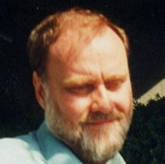
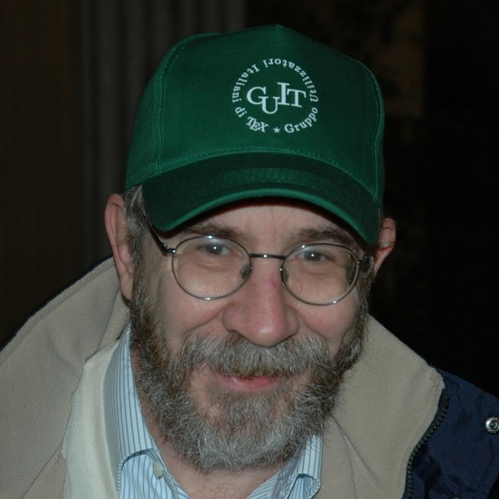

# Team

LaTeX is based on [Donald E. Knuth](https://en.wikipedia.org/wiki/Donald_Knuth)'s TeX typesetting language or certain extensions. LaTeX was first developed in 1985 by [Leslie Lamport](https://en.wikipedia.org/wiki/Leslie_Lamport), and is now being maintained and developed by the [LaTeX Project]({{site.baseurl}}/latex3/). 

<h2>Current Team Members</h2>

People currently involved in the LaTeX project are (in more or less chronological order): 

<ul class="team">
  <li id="frank-mittelbach">
    
    <h2>Frank Mittelbach  LaTeX3 Team</h2>
    <ul class="team">
      <li><a href="https://github.com/sponsors/FrankMittelbach">https://github.com/sponsors/FrankMittelbach</a></li>
      <li><a href="mailto:frank.mittelbach@latex-project.org">frank.mittelbach@latex-project.org</a></li>
      <li><a href="https://tex.stackexchange.com/users/10109/frank-mittelbach">https://tex.stackexchange.com/users/10109</a></li>
      <li><a href="https://de.linkedin.com/in/frankmittelbach">https://de.linkedin.com/in/frankmittelbach</a></li>
    </ul>
  </li>
  <li id="rainer-schoepf">
    
    <h2>Rainer Schöpf  LaTeX3 Team, Webmaster</h2>
  </li>
  <li id="chris-rowley">
    
    <h2>Chris Rowley  LaTeX3 Team</h2>
  </li>
  <li id="david-carlisle">
    
    <h2>David Carlisle  LaTeX3 Team</h2>
    <ul class="team">
      <li><a href="https://github.com/sponsors/davidcarlisle">https://github.com/sponsors/davidcarlisle</a></li>
      <li><a href="https://davidcarlisle.github.io/dcarlisle/david">https://davidcarlisle.github.io/dcarlisle/david</a></li>
      <li><a href="https://tex.stackexchange.com/users/1090/david-carlisle">https://tex.stackexchange.com/users/1090</a></li>
    </ul>
  </li>
  <li id="johannes-braams">
    
    <h2>Johannes Braams  LaTeX3 Team</h2>
    <ul class="team">
      <li><a href="https://www.xs4all.nl/~jlbraams/">https://www.xs4all.nl/~jlbraams/</a></li>
    </ul>
  </li>
  <li id="robin-fairbairns">
    
    <h2>Robin Fairbairns  LaTeX3 Team (retired)</h2>
  </li>

  <li id="will-robertson">
    
    <h2>Will Robertson  LaTeX3 Team</h2>
    <ul class="team">
      <li><a href="https://willwont.blogspot.com/">https://willwont.blogspot.com/</a></li>
      <li><a href="https://github.com/wspr">https://github.com/wspr</a></li>
    </ul>
  </li>
</ul>

<ul class="team">
  <li id="joseph-wright">
    
    <h2>Joseph Wright  LaTeX3 Team</h2>
    <ul class="team">
      <li><a href="https://github.com/sponsors/josephwright">https://github.com/sponsors/josephwright</a></li>
      <li><a href="mailto:joseph.wright@morningstar2.co.uk">joseph.wright@morningstar2.co.uk</a></li>
      <li><a href="skype:josephawright">josephawright</a></li>
      <li><a href="https://www.texdev.net/">https://www.texdev.net/</a></li>
      <li><a href="https://tex.stackexchange.com/users/73/joseph-wright">https://tex.stackexchange.com/users/73</a></li>
    </ul>
  </li>
  <li id="bruno-le-floch">
    
    <h2>Bruno Le Floch  LaTeX3 Team</h2>
    <ul class="team">
      <li><a href="mailto:blflatex@gmail.com">blflatex@gmail.com</a></li>
      <li><a href="https://github.com/blefloch">https://github.com/blefloch</a></li>
    </ul>
  </li>
  <li id="jonas-jacek">
    
    <h2>Jonas Jared Jacek  Web Development, Webmaster</h2>
    <ul class="team">
      <li><a href="https://www.jonas.me/">https://www.jonas.me/</a></li>
    </ul>
  </li>
  <li id="enrico-gregorio">
    
    <h2>Enrico Gregorio  LaTeX3 Team</h2>
    <ul class="team">
      <li><a href="http://profs.scienze.univr.it/~gregorio/egtex.html">http://profs.scienze.univr.it/~gregorio/egtex.html</a></li>
      <li><a href="https://tex.stackexchange.com/users/4427/egreg">https://tex.stackexchange.com/users/4427</a></li>
      <li><a href="https://github.com/eg9">https://github.com/eg9</a></li>
    </ul>
  </li>
  <li id="ulrike-fischer">
    
    <h2>Ulrike Fischer  LaTeX3 Team</h2>
    <ul class="team">
      <li><a href="https://tex.stackexchange.com/users/2388/ulrike-fischer">https://tex.stackexchange.com/users/2388/</a></li>
      <li><a href="https://github.com/u-fischer">https://github.com/u-fischer</a></li>
    </ul>
  </li>
  <li id="phelype-oleinik">
    
    <h2>Phelype Oleinik  LaTeX3 Team</h2>
    <ul class="team">
      <li><a href="https://tex.stackexchange.com/users/134574/phelype-oleinik">https://tex.stackexchange.com/users/134574/</a></li>
      <li><a href="https://github.com/PhelypeOleinik">https://github.com/PhelypeOleinik</a></li>
    </ul>
  </li>
  <li id="marcel-krueger">
    
    <h2>Marcel Krüger  LaTeX3 Team</h2>
    <ul class="team">
      <li><a href="mailto:tex@2krueger.de">tex@2krueger.de</a></li>
      <li><a href="https://tex.stackexchange.com/users/80496/marcel-kr%c3%bcger">https://tex.stackexchange.com/users/80496</a></li>
      <li><a href="https://github.com/zauguin">https://github.com/zauguin</a></li>
    </ul>
  </li>
</ul>

<h2>Former Team Members</h2>

Former members of the project team were: Denys Duchier, Michael Downes, Morten Høgholm, Alan Jeffrey, Martin Schröder, <a href="http://thomas-lotze.de/">Thomas Lotze</a>.

    

  

  

