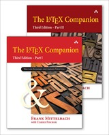
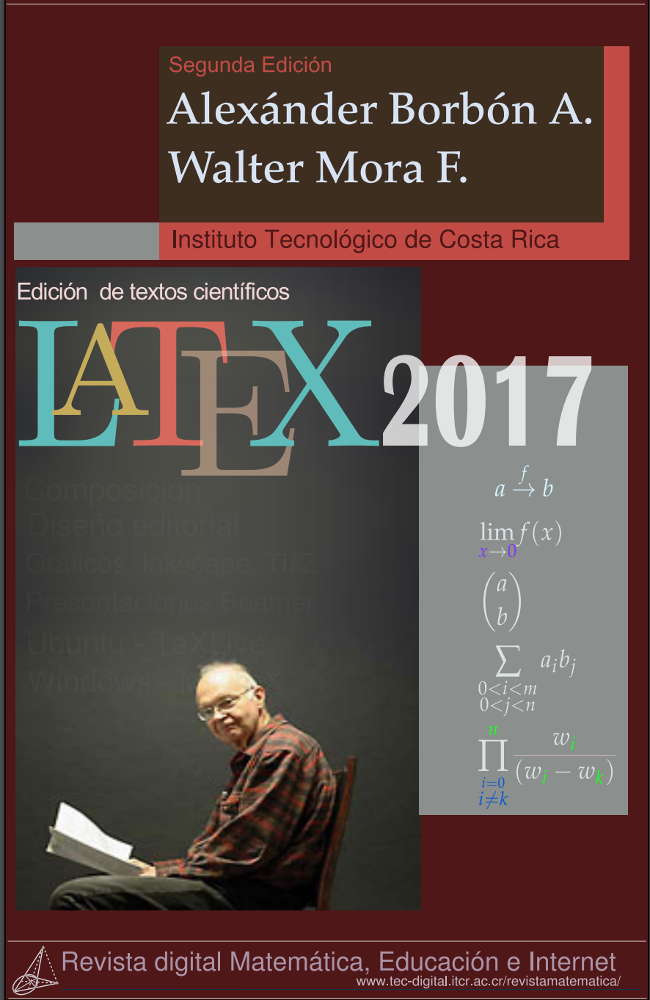
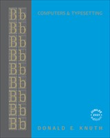

# TeX and LaTeX Books

  

    
A comprehensive list of books on LaTeX and related topics in English, French, German, and Spanish.
    All books are useful resources for everybody from new users who wish to learn, to experienced users who
    are looking for a reference.

    
This page lists <a href="#latex-books">books on LaTeX</a> and <a href="#related-reading">books
    on related topics</a> like TeX, fonts, and encoding.

    <h4><a href="{{ site.baseurl }}/publications/">Publications by the project team</a></h4>
    
The <a href="{{ site.baseurl }}/publications/">publications page</a> lists all articles and
    other publications by members of the LaTeX Project Team ordered chronologically
    or by topic.

  

  

    <ul class="toc">
      <li><a href="#english">LaTeX Books in English</a></li>
      <li><a href="#french">LaTeX Books in French</a></li>
      <li><a href="#german">LaTeX Books in German</a></li>
      <li><a href="#spanish">LaTeX Books in Spanish</a></li>
      <li><a href="#english-1">Related Books in English</a></li>
      <li><a href="#french-1">Related Books in French</a></li>
    </ul>
  

## LaTeX Books

### English

#### <a href="https://click.linksynergy.com/deeplink?id=g/Y5ZYi0Q7I&mid=24808&murl=https%3A%2F%2Fwww.informit.com%2Fstore%2Flatex-a-document-preparation-system-9780201529838" rel="nofollow" >LaTeX: A document preparation system, User's guide and reference manual</a>

{:width="150" height="189"}
**Edition:** 2nd edition  
**Authors:** Leslie Lamport  
**Language:** English  
**Date:** 1994  
**Publisher:** Addison Wesley  
**ISBN-10:** 0201529831  
**ISBN-13:** 978-0201529838  
**Pages:** 288 pages  

There is an [errata file](lamport-manual.pdf) for this book.

#### <a href="https://click.linksynergy.com/deeplink?id=g/Y5ZYi0Q7I&mid=24808&murl=https%3A%2F%2Fwww.informit.com%2Fstore%2Flatex-companion-parts-i-ii-9780135556849" rel="nofollow" >The LaTeX Companion, 3rd edition (TTCT series)</a>

{:width="180"}
**Edition:** 3rd edition (paperback edition)   
**Authors:** [Frank Mittelbach]({{site.baseurl}}/about/team/#frank-mittelbach) with [Ulrike Fischer]({{site.baseurl}}/about/team/#ulrike-fischer)   
**Date:** 2025  
**Language:** English  
**Publisher:** Addison-Wesley Professional  
**ISBN-13:** 978-0-13-555684-9
**Pages:** 976 (Part I)	and 1008 (Part II) pages  

Compared to the previous edition the third edition nearly doubled in size.
The print edition is therefore produced as a two-volume set --- the above information links to this bundle. The first printing was done as a hardcover, the later printings are now softcover.
 
It is also available as an <a href="https://click.linksynergy.com/deeplink?id=g/Y5ZYi0Q7I&mid=24808&murl=https%3A%2F%2Fwww.informit.com%2Fstore%2Flatex-companion-parts-i-ii-9780138115784" rel="nofollow" >eBook (Part I and II combined)</a>
consisting of PDF and ePub format without DRM.  Finally, the publisher
offers the combination of <a href="href="https://click.linksynergy.com/deeplink?id=g/Y5ZYi0Q7I&mid=24808&murl=https%3A%2F%2Fwww.informit.com%2Fstore%2Flatex-companion-parts-i-ii-9780135556849" rel="nofollow" >the printed books + the digital versions</a>
at a very attractive price not available anywhere else.
 
Some distributors offer the two parts of the edition also individually, but usually for a much higher price compared to the bundle.
Also important is that the digital version offered by some resellers only contains either the ePub or the PDF but not both! We therefore recommend that you watch out for this.

In Europe it might be easier to buy the print edition from bookshops or from resellers such as Amazon to avoid having to deal with import/customs fees, e.g.,
by using [Amazon.de in Germany](https://amzn.eu/d/dZ12xiM). However, note that the combination of print and digital formats is only available from the publisher's InformIT site through the link above.

There are some extracts from the third edition as PDF files to offer some impressions of its coverage:
+ <a href="tlc3-digital-preface.pdf" target="_blank" onclick="vgwPixelCall('1edd78f588df4fccb8edd771eb5e9727');">Preface of the 3rd edition</a> (317 kB)
+ <a href="tlc3-digital-toc.pdf" target="_blank" onclick="vgwPixelCall('1edd78f588df4fccb8edd771eb5e9727');">Table of contents</a> (337 kB)
+ <a href="tlc3-digital-chapter-samples.pdf" target="_blank" onclick="vgwPixelCall('348a5d49af564cf591c8447d2fd485ca');">Initial pages of *all* chapters</a> (3,4 MB)

As hard as you try books are never without some errors. Thus, as always we provide an [errata file](tlc3.err) that can be customized to show only errata relevant for printing you own (along with a precompiled [PDF version](tlc3-err.pdf)). We also run a competition among those who help us weed out any mistakes we have made, see the details in the errata file.

#### <a href="https://click.linksynergy.com/deeplink?id=g/Y5ZYi0Q7I&mid=24808&murl=https%3A%2F%2Fwww.informit.com%2Fstore%2Flatex-companion-9780201362992" rel="nofollow" >The LaTeX Companion, 2nd edition (TTCT series) --- previous edition</a>

{:width="160"}
**Edition:** 2nd edition  
**Authors:** [Frank Mittelbach]({{site.baseurl}}/about/team/#frank-mittelbach), Michel Goossens, [Johannes Braams]({{site.baseurl}}/about/team/#johannes-braams), [David Carlisle]({{site.baseurl}}/about/team/#david-carlisle), [Chris Rowley]({{site.baseurl}}/about/team/#chris-rowley)  
**Date:** 2004  
**Language:** English  
**Publisher:** Addison-Wesley Professional  
**ISBN-10:** 0201362996  
**ISBN-13:** 978-0201362992  
**Pages:** 1120 pages  

Also available as an <a href="https://click.linksynergy.com/deeplink?id=g/Y5ZYi0Q7I&mid=24808&murl=https%3A%2F%2Fwww.informit.com%2Fstore%2Flatex-companion-9780201362992" rel="nofollow" >eBook bundle</a> consisting of PDF and ePub format without DRM, see [news entry]({{site.baseurl}}/news/2013/11/02/latex-compagnion-ebook/) for more information.

There is an [errata file](tlc2.err) (along with a [PDF version](tlc2-err.pdf)). 

#### [The LaTeX Graphics Companion, 2nd edition (TTCT series)](https://amzn.to/3mPRpnB)

{:width="150" height="189"}
**Edition:** 2nd edition  
**Authors:** Michel Goossens, [Frank Mittelbach]({{site.baseurl}}/about/team/#frank-mittelbach), Sebastian Rahtz, Denis Roegel, Herbert Voß  
**Language:** English  
**Date:** 2007  
**Publisher:** Addison-Wesley Professional   
**ISBN-10:** 0321508920  
**ISBN-13:** 078-5342508925  
**Pages:** 976 pages

The book is no longer available from Addision-Wesely but is now reprinted by Lehmanns Media.

{:width="150" height="189"}
**Edition:** 2nd edition  
**Authors:** Michel Goossens, [Frank Mittelbach]({{site.baseurl}}/about/team/#frank-mittelbach), Sebastian Rahtz, Denis Roegel, Herbert Voß  
**Language:** English  
**Date:** 2022 (reprint of the 2009 version with corrections)   
**Publisher:** Lehmanns Media   
**ISBN-13:** 978-3-96543-303-8 (softcover)    
**ISBN-13:** 978-3-96543-299-4 (ebook)   
**Pages:** 976 pages

There are some extracts from the book as PDF files available from this site:

+  <a href="{{site.baseurl}}/help/books/bookpart_lgc2-excerpts.pdf" target="_blank" onclick="vgwPixelCall('d590c5a9cac547cb950b5cb45aa55413');">some excerpts from the book in one PDF file</a> (2.9 MB)
+  <a href="{{site.baseurl}}/help/books/bookpart_lgc2-ap3.pdf" target="_blank" onclick="vgwPixelCall('d590c5a9cac547cb950b5cb45aa55413');">bibliography and index</a> (1223 kB)

There is an [errata file](lgc2.err) (along with a [PDF version](lgc2-err.pdf)).

#### <a href="https://click.linksynergy.com/deeplink?id=g/Y5ZYi0Q7I&mid=24808&murl=https%3A%2F%2Fwww.informit.com%2Fstore%2Flatex-web-companion-integrating-tex-html-and-xml-9780201433111" rel="nofollow" >The LaTeX Web Companion Integrating TeX, HTML and XML (TTCT series)</a>

{:width="150" height="188"}
**Edition:** 1st edition  
**Authors:** Michel Goossens, Sebastian Rahtz  
**Language:** English  
**Date:** 1999  
**Publisher:** Addison-Wesley Professional   
**ISBN-10:** 0201433117  
**ISBN-13:** 978-0201433111  
**Pages:** 560 pages  

This book is no longer in print though you can still find second hand copies.

#### <a href="https://click.linksynergy.com/deeplink?id=g/Y5ZYi0Q7I&mid=24808&murl=https%3A%2F%2Fwww.informit.com%2Fstore%2Fguide-to-latex-adobe-reader-9780321639653" rel="nofollow" >Guide to LaTeX (TTCT series)</a>

{:width="150" height="210"}
**Edition:** 4th edition  
**Authors:** Helmut Kopka, Patrick W. Daly  
**Language:** English  
**Date:** 2003  
**Publisher:** Addison-Wesley Professional   
**ISBN-10:** 0321173856  
**ISBN-13:** 978-0321173850  
**Pages:** 624 pages  

These days it is available as an <a href="https://click.linksynergy.com/deeplink?id=g/Y5ZYi0Q7I&mid=24808&murl=https%3A%2F%2Fwww.informit.com%2Fstore%2Fguide-to-latex-adobe-reader-9780321639653" rel="nofollow" >eBook in ePub format</a> without DRM.

#### [LaTeX Beginner's Guide](https://www.packtpub.com/en-us/product/latex-beginners-guide-9781801078658)

{:width="150" height="187"}
**Edition:** 2nd edition  
**Author:** Stefan Kottwitz  
**Language:** English  
**Date:** 2025  
**Publisher:** Packt Publishing   
**ISBN-13:**  978-1801078658
**Pages:** 354 pages  

The LaTeX Beginner's Guide is packed with useful examples and explanations. 

#### [LaTeX Wikibook](https://en.wikibooks.org/wiki/LaTeX)

{:width="150" height="188"}
**Edition:** -  
**Author:** Wikibooks   
**Language:** English  
**Date:** -  
**Publisher:** Wikibooks   
**ISBN-10:** -  
**ISBN-13:** -  
**Pages:** ~214 pages  

From Wikibooks, this open-content textbook is intended to serve new users who wish to learn as well as old hands who need a quick reference. The book has a collection providing an on-demand PDF version as well as a printed book. It is available under a [Creative Commons Attribution-Share Alike 3.0 license](https://creativecommons.org/licenses/by-sa/3.0/).



 

### French

#### LaTeX Companion, 2e édition --- out of print

{:width="150" height="189"}
**Edition:** 2e édition  
**Authors:** [Frank Mittelbach]({{site.baseurl}}/about/team/#frank-mittelbach), Michel Goossens, [Johannes Braams]({{site.baseurl}}/about/team/#johannes-braams), [David Carlisle]({{site.baseurl}}/about/team/#david-carlisle), [Chris Rowley]({{site.baseurl}}/about/team/#chris-rowley)  
**Language:** French  
**Date:** 2006  
**Publisher:** Pearson   
**ISBN-10:** 2-7440-7182-X  
**ISBN-13:** 978-2-7440-7182-9  
**Pages:** 1116 pages  

Ce livre est la traduction de la 2e édition du
<a href="https://click.linksynergy.com/deeplink?id=g/Y5ZYi0Q7I&mid=24808&murl=https%3A%2F%2Fwww.informit.com%2Fstore%2Flatex-companion-9780201362992" rel="nofollow" >The LaTeX Companion, 2nd edition (TTCT series)</a> (voir ci-dessus). Des extraits du livre sont disponibles sur ce site:
<a href="{{site.baseurl}}/help/books/bookpart_tlc2fr-apb.pdf" target="_blank" onclick="vgwPixelCall('8563afc57cfe4e65a068251bc8f87935');">texte complet de l'annexe B, «Détecter et résoudre; les problèmes» file</a> (463 kB)

This book is a translation of <a href="https://click.linksynergy.com/deeplink?id=g/Y5ZYi0Q7I&mid=24808&murl=https%3A%2F%2Fwww.informit.com%2Fstore%2Flatex-companion-9780201362992" rel="nofollow" >The LaTeX Companion, 2nd edition (TTCT series)</a>. There is an extract from the book as PDF files available from this site:  <a href="{{site.baseurl}}/help/books/bookpart_tlc2fr-apb.pdf" target="_blank" onclick="vgwPixelCall('8563afc57cfe4e65a068251bc8f87935');">full text of appendix B, «Tracing and resolving problems» file</a> (463 kB)

### German

#### [LaTeX-Begleiter Bafög-Ausgabe (Pearson Studium - Scientific Tools) --- out of print](https://www.amazon.de/gp/product/386894088X/ref=as_li_tf_tl?ie=UTF8&camp=1638&creative=6742&creativeASIN=386894088X&linkCode=as2&tag=wwwlatexproje-21)

{:width="150" height="232"}
**Edition:** 2nd edition  
**Authors:** [Frank Mittelbach]({{site.baseurl}}/about/team/#frank-mittelbach), Michel Goossens, [Johannes Braams]({{site.baseurl}}/about/team/#johannes-braams), [David Carlisle]({{site.baseurl}}/about/team/#david-carlisle), [Chris Rowley]({{site.baseurl}}/about/team/#chris-rowley)  
**Language:** German  
**Date:** 2010  
**Publisher:** Pearson Studium   
**ISBN-10:** 386894088X  
**ISBN-13:** 978-3868940886  
**Pages:** 1168 pages  

This is a re-issue (student version) of the book [Der LaTeX-Begleiter, 2. Auflage](https://www.pearson-studium.de/main/main.asp?page=bookdetails&ProductID=106617) (ISBN 3-8273-7166-X) with identical content. This book is a translation of <a href="https://click.linksynergy.com/deeplink?id=g/Y5ZYi0Q7I&mid=24808&murl=https%3A%2F%2Fwww.informit.com%2Fstore%2Flatex-companion-9780201362992" rel="nofollow" >The LaTeX Companion, 2nd edition (TTCT series)</a> with a number of adaptations to the German language.

There are some extracts from the book as PDF files available from this site:

+ <a href="{{site.baseurl}}/help/books/bookpart_lb2-ch0.pdf"  target="_blank"   onclick="vgwPixelCall('5fb32d16fbb747d197e384299658523e');">tables of contents, figures, and tables and preface</a> (259 kB)
+ <a href="{{site.baseurl}}/help/books/bookpart_lb2-ch4.pdf"  target="_blank"   onclick="vgwPixelCall('5fb32d16fbb747d197e384299658523e');">full text of chapter 4, «Page layout»</a> (340 kB)
+ <a href="{{site.baseurl}}/help/books/bookpart_lb2-ap4.pdf"  target="_blank"   onclick="vgwPixelCall('5fb32d16fbb747d197e384299658523e');">bibliography and index</a> (857 kB)

There is an [errata file](lb2.err) (along with a [PDF version](lb2-err.pdf)).

Jürgen Fenn has written a review for the german TeX magazine "Die TeXnische Komödie". It is available as a [PDF file](fenn_lb2.pdf) (473 kB). 

#### [Einführung in LaTeX: unter Berücksichtigung von pdfLaTeX, XLaTeX und LuaLaTeX](https://www.amazon.de/gp/product/3865414621/ref=as_li_tf_tl?ie=UTF8&camp=1638&creative=6742&creativeASIN=3865414621&linkCode=as2&tag=wwwlatexproje-21)

{:width="150" height="221"}
**Edition:** 1st edition  
**Author:** Herbert Voß  
**Language:** German  
**Date:** 2012  
**Publisher:** Lehmanns   
**ISBN-10:** 3865414621  
**ISBN-13:** 978-3865414625  
**Pages:** 944 pages  

Herbert has written several other books on LaTeX topics, check out his [author page on amazon.de](https://www.amazon.de/Herbert-Vo%C3%9F/e/B0045AA4DO/?_encoding=UTF8&camp=1638&creative=6742&linkCode=ur2&site-redirect=de&tag=wwwlatexproje-21) and on [amazon.com](https://www.amazon.com/Herbert-Voss/e/B0045AA4DO/?_encoding=UTF8&camp=1789&creative=9325&linkCode=ur2&tag=lapr05-20). 

#### [Wissenschaftliche Arbeiten schreiben mit LaTeX: Leitfaden für Einsteiger (mitp Professional)](https://www.amazon.de/Wissenschaftliche-Arbeiten-schreiben-mit-LaTeX-dp-3747504469/dp/3747504469?&linkCode=ll1&tag=wwwlatexproje-21&linkId=4def1df24e5c6204bfefba936c430079&language=de_DE&ref_=as_li_ss_tl)

{:width="150" height="211"}
**Edition:** 7th edition  
**Author:** Joachim Schlosser  
**Language:** German  
**Date:** 2021  
**Publisher:** mitp   
**ISBN-10:** 3747504469
**ISBN-13:** 978-3747504468
**Pages:** 328 pages  

### Spanish

#### [LaTeX 2022](https://tecdigital.tec.ac.cr/servicios/revistamatematica/Libros/LaTeX/MoraW_BorbonA_LibroLaTeX.pdf)

{:width="150" height="233"}
**Edition:** 2nd edition  
**Authors:** Alexander Borbon A., Walter Mora F.  
**Language:** Spanish  
**Date:** 2022  
**Publisher:** Revista digital Matemática Educación e Internet   
**ISBN-13:** 978-9977-66-227-5  
**Pages:** 311 pages  

Licensed under [Creative Commons Attribution-NonCommercial-NoDerivs 3.0 Unported](https://creativecommons.org/licenses/by-nc-nd/3.0/) (CC BY-NC-ND 3.0)

The cover page changes once in a while so the above is an older one. Updated revisions also got new links in the past so you may have to search at [Revista digital Matemática Educación e Internet](https://tecdigital.tec.ac.cr/servicios/revistamatematica/material_didactico/libros/) if the above link is suddenly no longer valid.

#### [El libro de LaTeX](https://www.latex.um.es/libro/index.html)

{:width="150" height="212"}
**Edition:** 1st edition  
**Authors:** Bernardo Cascales Salinas, Pascual Lucas Saorín, José Manuel Mira Ros, Antonio Pallarés Ruiz, Salvador Sánchez-Pedreño Guillén  
**Language:** Spanish  
**Date:** 2003  
**Publisher:** Pearson Educacion   
**ISBN-10:** 8420537799   
**ISBN-13:** 9788420537795  
**Pages:** -  

May be difficult to find these days.

## Related Reading

### English

#### <a href="https://click.linksynergy.com/deeplink?id=g/Y5ZYi0Q7I&mid=24808&murl=https%3A%2F%2Fwww.informit.com%2Fstore%2Fcomputers-typesetting-volume-a-the-texbook-9780201134476" rel="nofollow" >Computers & Typesetting, Volume A: The TeXbook (Hardcover)</a>

{:width="150" height="189"}
**Edition:** 1st edition  
**Author:** Donald E. Knuth  
**Language:** English  
**Date:** 1986  
**Publisher:** Addison-Wesley Professional   
**ISBN-10:** 0-201-13447-0   
**ISBN-13:** 978-0-201-13447-6  
**Pages:** 496 pages  

#### <a href="https://click.linksynergy.com/deeplink?id=g/Y5ZYi0Q7I&mid=24808&murl=https%3A%2F%2Fwww.informit.com%2Fstore%2Fcomputers-typesetting-volume-b-tex-the-program-9780201134377" rel="nofollow" >Computers & Typesetting, Volume B: TeX the program (Hardcover)</a>

{:width="150" height="200"}
**Edition:** 1st edition  
**Author:** Donald E. Knuth  
**Language:** English  
**Date:** 1986  
**Publisher:** Addison-Wesley Professional   
**ISBN-13:** 978-0-201-13448-7  
**Pages:** 624 pages  

#### [Fonts & Encodings](https://www.amazon.com/Fonts-Encodings-Yannis-Haralambous/dp/0596102429/?_encoding=UTF8&camp=1789&creative=9325&linkCode=ur2&tag=lapr05-20)

{:width="150" height="197"}
**Edition:** 1st edition  
**Author:** Yannis Haralambous  
**Language:** English  
**Date:** 2007  
**Publisher:** O'Reilly Media   
**ISBN-10:** 0596102429   
**ISBN-13:** 978-0596102425  
**Pages:** 1040 pages  

### French

#### [Le TeXbook : Composition informatique](https://www.amazon.fr/Texbook-Composition-informatique-Donald-Knuth/dp/2711748197/)

{:width="150" height="217"}
**Edition:** 1st edition  
**Author:** Donald E. Knuth  
**Language:** French  
**Date:** 2003  
**Publisher:** Vuibert   
**ISBN-10:** 2711748197   
**ISBN-13:** 978-2711748198  
**Pages:** 555 pages  

#### [Fontes et Codages](https://www.amazon.fr/Fontes-Codages-Yannis-Haralambous/dp/284177273X)

{:width="150" height="206"}
**Edition:** 1st edition  
**Author:** Yannis Haralambous  
**Language:** French  
**Date:** 2004  
**Publisher:** O'Reilly Media   
**ISBN-10:** 284177273X   
**ISBN-13:** 978-2841772735  
**Pages:** 1012 pages  

  <section class="col cell1of3"></section>
  <section class="col cell1of3"></section>
  <section class="col cell1of3"></section>

