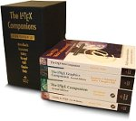
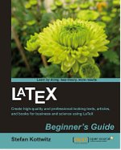
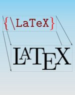
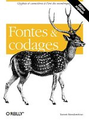

# TeX and LaTeX Books

  

    
A comprehensive list of books on LaTeX and related topics in English, French, German, and Spanish. All books are useful resources for everybody from new users who wish to learn, to experienced users who are looking for a reference.

    
This page lists <a href="#latex-books">books on LaTeX</a> and <a href="#related-reading">books on related topics</a> like TeX, fonts, and encoding.

  

  

    <ul class="toc">
      <li><a href="#english">LaTeX Books in English</a></li>
      <li><a href="#french">LaTeX Books in French</a></li>
      <li><a href="#german">LaTeX Books in German</a></li>
      <li><a href="#spanish">LaTeX Books in Spanish</a></li>
      <li><a href="#english-1">Related Books in English</a></li>
      <li><a href="#french-1">Related Books in French</a></li>
    </ul>
  

## LaTeX Books

### English

#### [LaTeX: A document preparation system, User's guide and reference manual](http://click.linksynergy.com/fs-bin/click?id=g/Y5ZYi0Q7I&subid=&offerid=163217.1&type=10&tmpid=12438&RD_PARM1=http%253A%252F%252Fwww.informit.com%252Fstore%252Flatex-a-document-preparation-system-9780201529838)

{:width="150" height="189"}
**Edition:** 2nd edition  
**Authors:** Leslie Lamport  
**Language:** English  
**Date:** 1994  
**Publisher:** Addison Wesley  
**ISBN-10:** 0201529831  
**ISBN-13:** 978-0201529838  
**Pages:** 288 pages  

There is an [errata file](manual.err) for this book.

#### [The LaTeX Companion, 2nd edition (TTCT series)](http://click.linksynergy.com/fs-bin/click?id=g/Y5ZYi0Q7I&subid=&offerid=163217.1&type=10&tmpid=12438&RD_PARM1=http%253A%252F%252Fwww.informit.com%252Fstore%252Flatex-companion-9780201362992)

{:width="150" height="189"}
**Edition:** 2nd edition  
**Authors:** [Frank Mittelbach]({{site.baseurl}}/about/team/#frank-mittelbach), Michel Goossens, [Johannes Braams]({{site.baseurl}}/about/team/#johannes-braams), [David Carlisle]({{site.baseurl}}/about/team/#david-carlisle), [Chris Rowley]({{site.baseurl}}/about/team/#chris-rowley)  
**Date:** 2004  
**Language:** English  
**Publisher:** Addison-Wesley Professional  
**ISBN-10:** 0201362996  
**ISBN-13:** 978-0201362992  
**Pages:** 1120 pages  

Also available as an [eBook bundle](http://click.linksynergy.com/fs-bin/click?id=g/Y5ZYi0Q7I&subid=&offerid=163217.1&type=10&tmpid=12438&RD_PARM1=http%253A%252F%252Fwww.informit.com%252Fstore%252Flatex-companion-9780201362992) consisting of PDF, mobi and ePub format without DRM, see [news entry]({{site.baseurl}}/news/2013/11/02/latex-compagnion-ebook/).

There are some extracts from the book as PDF files available from this site:

+ <a href="tlc2-ch0.pdf" target="_blank" onclick="vgwPixelCall('7d58e1729e9e4cf0946c2d9db00fbe60');">tables of contents, figures, and tables and preface</a> (176 kB)
+ <a href="tlc2-ch3.pdf" target="_blank" onclick="vgwPixelCall('400c4c45851a48f6afdb9db1d7fc0ff7');">full text of chapter 3, «Basic formatting tools»</a> (780 kB)
+ [bibliography and index](tlc2-ap4.pdf) (796 kB)

There is an [errata file](tlc2.err) (along with a [PDF version](tlc2-err.pdf)) which also has details on the bug contest: Addison-Wesley and the authors of TLC2 provide a number of prizes for people finding errors in the book. 

#### [The LaTeX Graphics Companion, 2nd edition (TTCT series)](http://click.linksynergy.com/fs-bin/click?id=g/Y5ZYi0Q7I&offerid=145238.10000313&type=3&subid=0)

{:width="150" height="189"}
**Edition:** 2nd edition  
**Authors:** Michel Goossens, [Frank Mittelbach]({{site.baseurl}}/about/team/#frank-mittelbach), Sebastian Rahtz, Denis Roegel, Herbert Voss  
**Language:** English  
**Date:** 2007  
**Publisher:** Addison-Wesley Professional   
**ISBN-10:** 0321508920  
**ISBN-13:** 078-5342508925  
**Pages:** 976 pages  

+  <a href="{{site.baseurl}}/help/books/lgc2-excerpts.pdf" target="_blank" onclick="vgwPixelCall('d590c5a9cac547cb950b5cb45aa55413');">some excerpts from the book in one PDF file</a> (2.9 MB)
+ [bibliography and index](lgc2-ap3.pdf) (1223 kB)
+ [supplementary material on the web](http://xml.web.cern.ch/XML/lgc2/) maintained by Michel Goossens

There is an [errata file](lgc2.err) (along with a [PDF version](lgc2-err.pdf)) which also has details on the bug contest: Addison-Wesley and the authors of LGC2 provide a number of prizes for people finding errors in the book.

#### [The LaTeX Web Companion Integrating TeX, HTML and XML (TTCT series)](http://click.linksynergy.com/fs-bin/click?id=g/Y5ZYi0Q7I&subid=&offerid=163217.1&type=10&tmpid=12438&RD_PARM1=http%253A%252F%252Fwww.informit.com%252Fstore%252Flatex-web-companion-integrating-tex-html-and-xml-9780201433111)

{:width="150" height="188"}
**Edition:** 1st edition  
**Authors:** Michel Goossens, Sebastian Rahtz  
**Language:** English  
**Date:** 1999  
**Publisher:** Addison-Wesley Professional   
**ISBN-10:** 0201433117  
**ISBN-13:** 978-0201433111  
**Pages:** 560 pages  

#### [Guide to LaTeX (TTCT series)](http://click.linksynergy.com/fs-bin/click?id=g/Y5ZYi0Q7I&subid=&offerid=163217.1&type=10&tmpid=12438&RD_PARM1=http%253A%252F%252Fwww.informit.com%252Fstore%252Fguide-to-latex-9780321173850)

{:width="150" height="210"}
**Edition:** 4th edition  
**Authors:** Helmut Kopka, Patrick W. Daly  
**Language:** English  
**Date:** 2003  
**Publisher:** Addison-Wesley Professional   
**ISBN-10:** 0321173856  
**ISBN-13:** 978-0321173850  
**Pages:** 624 pages  

Also available as an [eBook bundle](http://click.linksynergy.com/fs-bin/click?id=g/Y5ZYi0Q7I&subid=&offerid=163217.1&type=10&tmpid=3559&RD_PARM1=http%253A%252F%252Fwww.informit.com%252Fstore%252Fguide-to-latex-9780321173850) consisting of PDF, mobi and ePub format without DRM.

#### [The LaTeX Companions Third Revised Boxed Set](http://click.linksynergy.com/fs-bin/click?id=g/Y5ZYi0Q7I&offerid=145238.10000312&type=3&subid=0)

{:width="150" height="134"}
**Edition:** 3rd revised box set  
**Authors:** [Frank Mittelbach]({{site.baseurl}}/about/team/#frank-mittelbach), Michel Goossens, Sebastian Rahtz, Denis Roegel, Herbert Voss, Helmut Kopka, Patrick W. Daly  
**Language:** English  
**Date:** 2008  
**Publisher:** Addison-Wesley Professional   
**ISBN-10:** 1847199860  
**ISBN-13:** 978-0321514431  
**Pages:** 3328 pages  

A Complete Guide and Reference for Preparing, Illustrating and Publishing Technical Documents. This is a boxed set of the titles in the series _Tools and Techniques for Computer Typesetting (TTCT)_ at a reduced price, consisting of the following books: 

+ Guide to LaTeX, 4th edition
+ The LaTeX Companion, 2nd edition
+ The LaTeX Graphics Companion, 2nd edition
+ The LaTeX Web Companion

#### [LaTeX Beginner's Guide](https://www.packtpub.com/latex-beginners-guide/book)

{:width="150" height="187"}
**Edition:** 1st edition  
**Author:** Stefan Kottwitz  
**Language:** English  
**Date:** 2011  
**Publisher:** Packt Publishing   
**ISBN-10:** 0321173856  
**ISBN-13:** 978-1847199867  
**Pages:** 336 pages  

The LaTeX Beginner's Guide is packed with useful examples and explanations. 

#### [LaTeX Wikibook](https://en.wikibooks.org/wiki/LaTeX)

{:width="150" height="188"}
**Edition:** -  
**Author:** Wikibooks   
**Language:** English  
**Date:** -  
**Publisher:** Wikibooks   
**ISBN-10:** -  
**ISBN-13:** -  
**Pages:** ~214 pages  

From Wikibooks, this open-content textbook is intended to serve new users who wish to learn as well as old hands who need a quick reference. The book has a collection providing an on-demand PDF version as well as a printed book. It is available under a [Creative Commons Attribution-Share Alike 3.0 license](https://creativecommons.org/licenses/by-sa/3.0/).



 

### French

#### [LaTeX Companion, 2e édition](http://www.pearson.fr/livre/?GCOI=27440100048330)

{:width="150" height="189"}
**Edition:** 2e édition  
**Authors:** [Frank Mittelbach]({{site.baseurl}}/about/team/#frank-mittelbach), Michel Goossens, [Johannes Braams]({{site.baseurl}}/about/team/#johannes-braams), [David Carlisle]({{site.baseurl}}/about/team/#david-carlisle), [Chris Rowley]({{site.baseurl}}/about/team/#chris-rowley)  
**Language:** French  
**Date:** 2006  
**Publisher:** Pearson   
**ISBN-10:** 2-7440-7182-X  
**ISBN-13:** 978-2-7440-7182-9  
**Pages:** 1116 pages  

Ce livre est la traduction de la 2e édition du [The LaTeX Companion](http://www.informit.com/store/latex-companion-9780201362992) (voir ci-dessus). Des extraits du livre sont disponibles sur ce site: [texte complet de l'annexe B, «Détecter et résoudre; les problèmes»](lc2fr-apb.pdf) (463 kB)

This book is a translation of [The LaTeX Companion, 2nd edition](http://www.informit.com/store/latex-companion-9780201362992). There is an extract from the book as PDF files available from this site: [full text of appendix B, «Tracing and resolving problems»](lc2fr-apb.pdf) (463 kB)

### German

#### [LaTeX-Begleiter Bafög-Ausgabe (Pearson Studium - Scientific Tools)](http://www.amazon.de/gp/product/386894088X/ref=as_li_tf_tl?ie=UTF8&camp=1638&creative=6742&creativeASIN=386894088X&linkCode=as2&tag=wwwlatexproje-21)

{:width="150" height="232"}
**Edition:** 2nd edition  
**Authors:** [Frank Mittelbach]({{site.baseurl}}/about/team/#frank-mittelbach), Michel Goossens, [Johannes Braams]({{site.baseurl}}/about/team/#johannes-braams), [David Carlisle]({{site.baseurl}}/about/team/#david-carlisle), [Chris Rowley]({{site.baseurl}}/about/team/#chris-rowley)  
**Language:** German  
**Date:** 2010  
**Publisher:** Pearson Studium   
**ISBN-10:** 386894088X  
**ISBN-13:** 978-3868940886  
**Pages:** 1168 pages  

This is a re-issue (student version) of the book [Der LaTeX-Begleiter, 2. Auflage](http://www.pearson-studium.de/main/main.asp?page=bookdetails&ProductID=106617) (ISBN 3-8273-7166-X) with identical content. This book is a translation of [The LaTeX Companion, 2nd edition (TTCT series)](http://click.linksynergy.com/fs-bin/click?id=g/Y5ZYi0Q7I&offerid=145238.10000314&type=3&subid=0) with a number of adaptations to the German language.

There are some extracts from the book as PDF files available from this site:

+ [tables of contents, figures, and tables and preface](lb2-ch0.pdf) (259 kB)
+ <a href="{{site.baseurl}}/help/books/lb2-ch4.pdf"  target="_blank"   onclick="vgwPixelCall('5fb32d16fbb747d197e384299658523e');">full text of chapter 4, «Page layout»</a> (340 kB)
+ [bibliography and index](lb2-ap4.pdf) (857 kB)

There is an [errata file](lb2.err) (along with a [PDF version](lb2-err.pdf)) which also has details on the bug contest: Pearson Studium and the authors of LB2 provide Pearson text books as prizes for people finding errors in the book.

Jürgen Fenn has written a review for the german TeX magazine "Die TeXnische Komödie". It is available as a [PDF file](fenn_lb2.pdf) (473 kB). 

#### [Einführung in LaTeX: unter Berücksichtigung von pdfLaTeX, XLaTeX und LuaLaTeX](http://www.amazon.de/gp/product/3865414621/ref=as_li_tf_tl?ie=UTF8&camp=1638&creative=6742&creativeASIN=3865414621&linkCode=as2&tag=wwwlatexproje-21)

{:width="150" height="221"}
**Edition:** 1st edition  
**Author:** Herbert Voss  
**Language:** German  
**Date:** 2012  
**Publisher:** Lehmanns   
**ISBN-10:** 3865414621  
**ISBN-13:** 978-3865414625  
**Pages:** 944 pages  

Herbert has written several other books on LaTeX topics, check out his [author page on amazon.de](http://www.amazon.de/Herbert-Vo%C3%9F/e/B0045AA4DO/?_encoding=UTF8&camp=1638&creative=6742&linkCode=ur2&site-redirect=de&tag=wwwlatexproje-21) and on [amazon.com](http://www.amazon.com/Herbert-Voss/e/B0045AA4DO/?_encoding=UTF8&camp=1789&creative=9325&linkCode=ur2&tag=lapr05-20). 

#### [Wissenschaftliche Arbeiten schreiben mit LaTeX: Leitfaden für Einsteiger (mitp Professional)](http://www.amazon.de/gp/product/3826694864/ref=as_li_tf_tl?ie=UTF8&camp=1638&creative=6742&creativeASIN=3826694864&linkCode=as2&tag=wwwlatexproje-21)

{:width="150" height="211"}
**Edition:** 5th edition  
**Author:** Joachim Schlosser  
**Language:** German  
**Date:** 2013  
**Publisher:** mitp   
**ISBN-10:** 3826694864  
**ISBN-13:** 978-3826694868  
**Pages:** 328 pages  

### Spanish

#### [LaTeX 2014](http://tecdigital.tec.ac.cr/revistamatematica/Libros/LATEX/LaTeX_2014.pdf)

{:width="150" height="233"}
**Edition:** 2nd edition  
**Authors:** Alexander Borbon A., Walter Mora F.  
**Language:** Spanish  
**Date:** 2014  
**Publisher:** Revista digital Matemática Educación e Internet   
**ISBN-10:** 0   
**ISBN-13:** 978-9977-66-227-5  
**Pages:** 304 pages  

Licensed under [Creative Commons Attribution-NonCommercial-NoDerivs 3.0 Unported](https://creativecommons.org/licenses/by-nc-nd/3.0/) (CC BY-NC-ND 3.0)  Download is 17Mb

#### [El libro de LaTeX](http://www.latex.um.es/libro/index.html)

{:width="150" height="212"}
**Edition:** 1st edition  
**Authors:** Bernardo Cascales Salinas, Pascual Lucas Saorín, José Manuel Mira Ros, Antonio Pallarés Ruiz, Salvador Sánchez-Pedreño Guillén  
**Language:** Spanish  
**Date:** 2003  
**Publisher:** Pearson Educacion   
**ISBN-10:** 8420537799   
**ISBN-13:** 9788420537795  
**Pages:** -  

May be difficult to find these days.

## Related Reading

### English

#### [Computers & Typesetting, Volume A: The TeXbook (Hardcover)](http://click.linksynergy.com/fs-bin/click?id=g/Y5ZYi0Q7I&subid=&offerid=163217.1&type=10&tmpid=12438&RD_PARM1=http%253A%252F%252Fwww.informit.com%252Fstore%252Fcomputers-typesetting-volume-a-the-texbook-9780201134476)

{:width="150" height="189"}
**Edition:** 1st edition  
**Author:** Donald E. Knuth  
**Language:** English  
**Date:** 1986  
**Publisher:** Addison-Wesley Professional   
**ISBN-10:** 0-201-13447-0   
**ISBN-13:** 978-0-201-13447-6  
**Pages:** 496 pages  

#### [The TeXbook](http://click.linksynergy.com/fs-bin/click?id=g/Y5ZYi0Q7I&subid=&offerid=163217.1&type=10&tmpid=12438&RD_PARM1=http%253A%252F%252Fwww.informit.com%252Fstore%252Ftexbook-9780201134483)

{:width="150" height="200"}
**Edition:** 1st edition  
**Author:** Donald E. Knuth  
**Language:** English  
**Date:** 1984  
**Publisher:** Addison-Wesley Professional   
**ISBN-10:** 0-201-13448-9   
**ISBN-13:** 978-0-201-13448-3  
**Pages:** 496 pages  

#### [Fonts & Encodings](http://www.amazon.com/Fonts-Encodings-Yannis-Haralambous/dp/0596102429/?_encoding=UTF8&camp=1789&creative=9325&linkCode=ur2&tag=lapr05-20)

{:width="150" height="197"}
**Edition:** 1st edition  
**Author:** Yannis Haralambous  
**Language:** English  
**Date:** 2007  
**Publisher:** O'Reilly Media   
**ISBN-10:** 0596102429   
**ISBN-13:** 978-0596102425  
**Pages:** 1040 pages  

### French

#### [Le TeXbook : Composition informatique](http://www.amazon.fr/Texbook-Composition-informatique-Donald-Knuth/dp/2711748197/)

{:width="150" height="217"}
**Edition:** 1st edition  
**Author:** Donald E. Knuth  
**Language:** French  
**Date:** 2003  
**Publisher:** Vuibert   
**ISBN-10:** 2711748197   
**ISBN-13:** 978-2711748198  
**Pages:** 555 pages  

#### [Fontes et Codages](http://www.amazon.fr/Fontes-Codages-Yannis-Haralambous/dp/284177273X)

{:width="150" height="206"}
**Edition:** 1st edition  
**Author:** Yannis Haralambous  
**Language:** French  
**Date:** 2004  
**Publisher:** O'Reilly Media   
**ISBN-10:** 284177273X   
**ISBN-13:** 978-2841772735  
**Pages:** 1012 pages  

  <section class="col cell1of3"></section>
  <section class="col cell1of3"></section>
  <section class="col cell1of3"></section>

